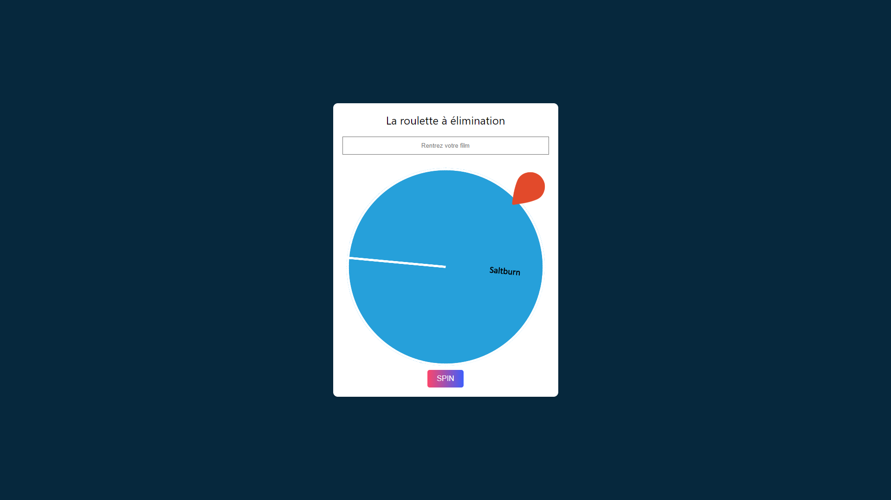

<h1 align="center">Elimination Wheel project</h1>

This little side project was inspired by an evening with a friend. When we couldn't agree on which film to choose, we decided to let a wheel the last word. Not wanting the classic wheel system, in order to spice up the selection we looked an elimination system. Finding nothing on the web, I submit this project today.

<h2 align="center">Starting</h2>

yarn install
 
yarn add react-custom-roulette

<h2 align="center">Documentation</h2>

ReactJS
 
React Custom Roulette : <a href="https://www.npmjs.com/package/react-custom-roulette">https://www.npmjs.com/package/react-custom-roulette</a>

<h2 align="center">Credits</h2>

Many thanks to <a href="https://github.com/effectussoftware">Effectus Software</a> for the <a href="https://github.com/effectussoftware/react-custom-roulette">React Custom Roulette</a>

